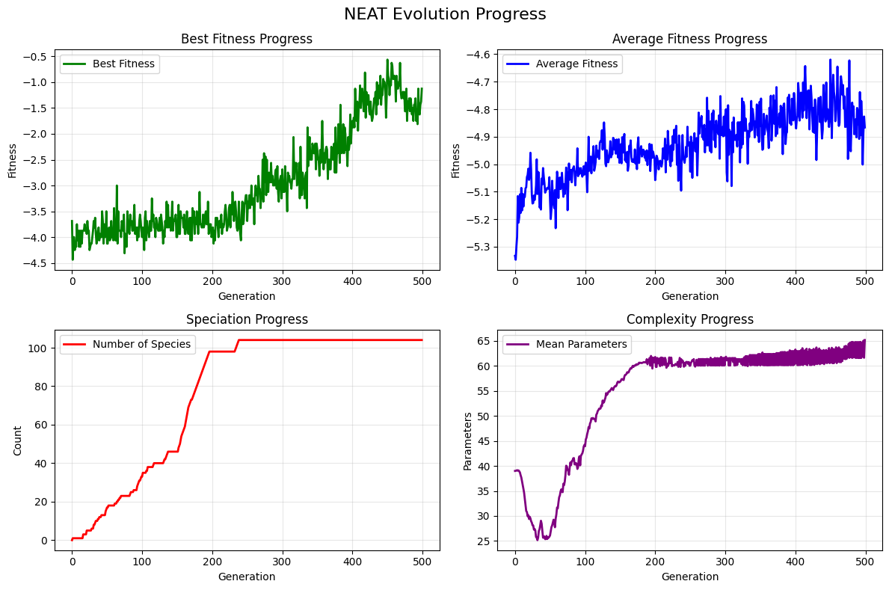
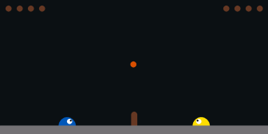
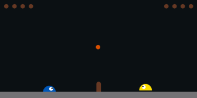

# NEAT-JAX

A JAX implementation of **NEAT** (NeuroEvolution of Augmenting Topologies) - an evolutionary algorithm that learns both the structure and weights of neural networks.

## What is NEAT?

Instead of training neural networks with backpropagation, NEAT evolves them through natural selection:

1. **Start Simple**: Begin with minimal networks (just inputs connected to outputs)
2. **Mutate & Evolve**: Add neurons and connections, and perturb weights through random mutations
3. **Compete**: Networks compete to solve tasks - the best ones survive
4. **Speciate**: Protect innovation by grouping similar networks into species

NEAT is so interesting because it learns **topology and weights together**. NEAT discovers the right architecture while optimizing it.

## Results: SlimeVolley

There are a couple of examples in the `examples/` folder. The most interesting one is SlimeVolley. We trained an agent to play [SlimeVolley](https://github.com/hardmaru/slimevolleygym), a game where the goal is to beat a computer-controlled opponent in a volleyball match. We started with 128 randomly-initialized fully-connected networks, which mutated, reproduced, and evolved over 500 generations.

### Evolution Progress

Open `results/evolution.gif` to see how the network evolved to play the game. It starts from a simple randomly initialized network (no hidden layers) and grows to a complex network that can play the game!

### Training Metrics



Key observations from evolution:
- **Fitness**: Fitness is basically the same as reward in the RL world. We see that it steadily improves as networks discover better strategies (green line shows the fitness of the best network in each generation, and the blue line shows the average fitness of all networks in each generation)
- **Complexity**: Networks naturally grow more complex as they evolve, measured by the number of parameters
- **Speciation**: Multiple species emerge, protecting diverse approaches

### Gameplay

Our policy is in yellow, on the right side of the screen.

**Generation 0** (untrained):  


The randomly initialized model gets a lucky hit in the first turn, but then as expected, it loses quickly without being able to hit any other ball.

**Generation 450** (best policy):  


The evolved policy learns to track the ball and make strategic plays. It plays the game for much longer before losing. If I had the resources to sweep hyperparameters, it could probably play much longer and even win!

## Quick Start

```python
from src.population import NEATConfig
from src.evaluator import SimpleEvaluator
from src.trainer import evolve
import jax

config = NEATConfig() # contains hyperparams; use defaults
evaluator = SimpleEvaluator(your_fitness_function)

# Note: `your_fitness_function` above is a function
# that takes a genome and a JAX random key and returns
# a fitness score

# Evolve! (Train!)
result = evolve(
  n_inputs=3, # number of inputs
  n_outputs=5, # number of outputs
  generations=500, # number of generations
  evaluator=evaluator,
  config=config,
  key=jax.random.PRNGKey(42)
)
```

See `examples/` for complete examples (XOR, CartPole, SlimeVolley).

## References

Based on Kenneth O. Stanley's original NEAT paper: "[Evolving Neural Networks through Augmenting Topologies](https://nn.cs.utexas.edu/downloads/papers/stanley.cec02.pdf)" (2002)
